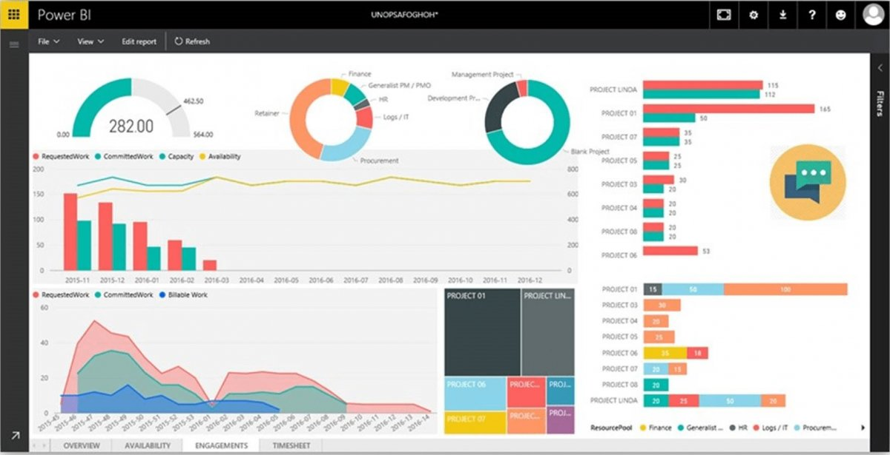

Power BI Report: Resource Management Dashboard

This Power BI report provides a comprehensive overview of resource allocation and project management, enabling effective decision-making and enhanced productivity. Below is a detailed explanation of the components included in this dashboard.

Key Features

KPI Metrics

Displays total hours (e.g., committed work, requested work, and availability) in a gauge chart for quick assessment.

Resource Pool Distribution

Pie charts categorize resources based on key departments such as Finance, HR, Procurement, and IT, providing insights into resource allocation.

Timeline Analysis

A line graph tracks changes in requested work, committed work, and capacity over time to identify trends and plan resources accordingly.

Project Insights

Bar charts highlight individual project performance by comparing metrics like committed work and requested work.

Stacked Area Chart

A visual representation of billable work versus committed work across multiple time periods.

Project Overview Cards

A segmented view that lists projects for quick reference.

Navigation Tabs

Overview: High-level metrics and key performance indicators.

Availability: Resource availability analysis across projects.

Engagements: Insights into resource utilization.

Timesheet: Detailed breakdown of resource activities and timelines.

Usage Guide

Open the Power BI report in the Power BI Desktop or Online Service.

Interact with the filters on the right-hand side to customize the report view.

Use slicers to focus on specific timeframes, projects, or resource pools.

Click on any visual to drill down into more granular data.

Benefits

Real-Time Insights: Gain a live view of resource metrics and project status.

Improved Decision-Making: Identify bottlenecks and reallocate resources effectively.

Enhanced Collaboration: Share insights with stakeholders to align goals and priorities.
